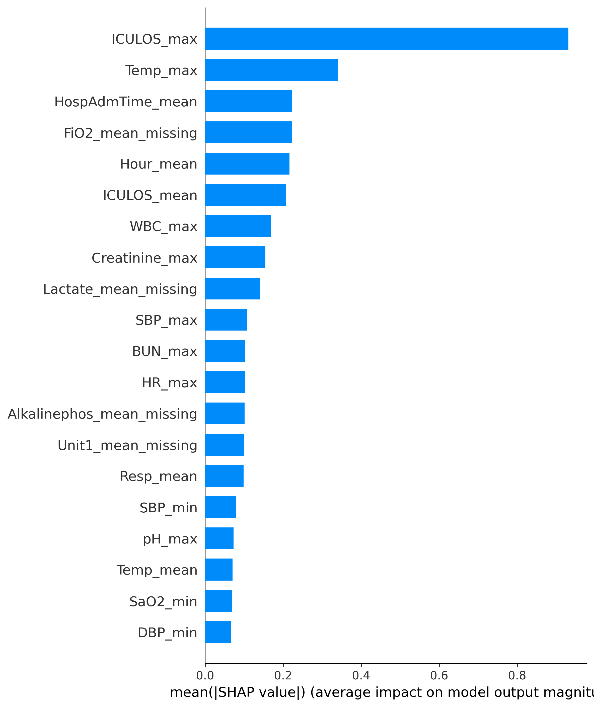

# Sepsis Risk Stratification in ICU Patients Using Aggregated Clinical Features

This repository implements a machine learning pipeline for early warning risk prediction of sepsis in ICU patients using routinely collected clinical variables.

The objective is to estimate patient-level sepsis risk from ICU time-series data, focusing on model transparency and reproducible preprocessing rather than real-time deployment.

# Problem Description

Sepsis is a major cause of morbidity and mortality in intensive care units.
This project explores whether structured ICU data can be used to generate early warning risk scores that distinguish higher-risk patients from lower-risk ones.

The task is formulated as a binary risk prediction problem using hourly ICU measurements.

# Dataset Characteristics

-One row per patient per ICU hour

Includes:

-Patient identifier

-ICU time index

-Vital signs and laboratory values

-Binary sepsis label

No external clinical rules or handcrafted scores are used.

# Notebook Overview

The notebook sepsis_early_warning_icu_ml.ipynb contains only executable code cells.
The logical structure is implicit in the code and follows standard clinical ML practice:

-Data loading and basic structural checks

-Patient-level temporal ordering

-Feature and target separation

-Patient-level train–test split

-Missing-value handling

-Median imputation

-Explicit missingness indicators

-Gradient-boosted tree model training

-Risk score evaluation (no threshold tuning)

-Global feature importance analysis using SHAP

# Evaluation Approach

-The model outputs continuous risk scores

-No classification threshold is selected

-Evaluation focuses on:

  -Discriminative ability

  -Cohort-level risk stratification

This avoids arbitrary alert thresholds and reflects exploratory clinical modeling

# Model Interpretability

Global feature importance is analyzed using SHAP values.

This visualization highlights clinical variables that consistently influence predicted sepsis risk.
