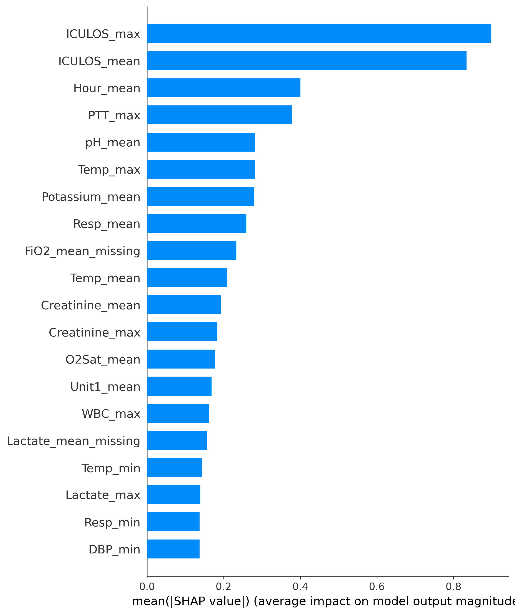
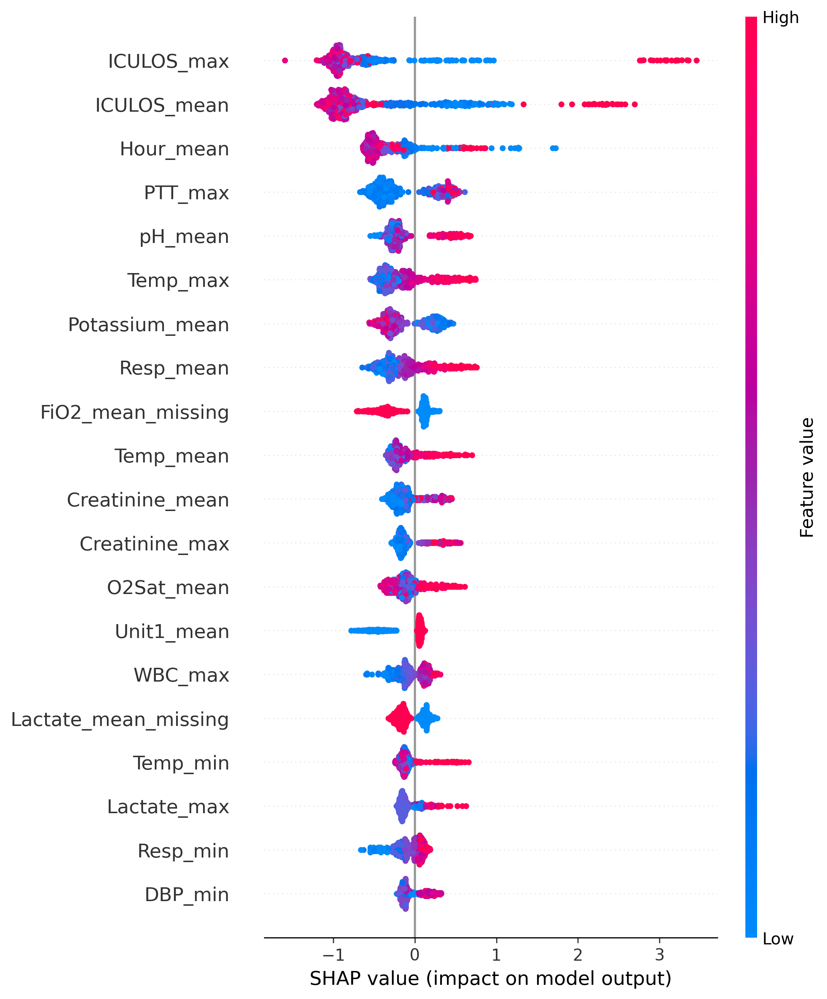

# Sepsis Early Warning in ICU Using Machine Learning

## Overview
Sepsis is a leading cause of morbidity and mortality in intensive care units (ICUs). Early identification is clinically challenging due to heterogeneous patient trajectories, missing data, and severe class imbalance.

This repository presents a machine learning–based early warning system for sepsis using structured ICU clinical data. The project explicitly prioritises early risk detection and sensitivity over accuracy, reflecting real-world clinical decision-making where missed sepsis cases carry high cost.

Two modeling approaches are evaluated:
- A transparent linear baseline (Logistic Regression)
- A tree-based model (XGBoost)

Model interpretability is addressed using **SHAP** to identify clinically meaningful drivers of sepsis risk.

---

## Clinical Motivation
Early sepsis prediction differs fundamentally from retrospective diagnosis. Models must operate under uncertainty, tolerate false positives, and provide defensible explanations.

This project focuses on:
- Early warning rather than final diagnosis  
- Clinically defensible decision thresholds  
- Transparent interpretation of model predictions  

---

## Dataset
- ICU patient-level dataset  
- Binary outcome: `sepsis` vs `non-sepsis`  
- Strongly imbalanced class distribution (sepsis as minority class)

### Preprocessing
- Feature selection based on clinical relevance  
- Consistent train–test feature alignment  
- Native handling of missing values in tree-based models  

---

## Modeling Strategy

### Model 1: Logistic Regression (Baseline)
A transparent linear model is used to establish a performance reference.

**Key characteristics:**
- Probabilistic outputs  
- Explicit threshold tuning  
- Serves as an interpretable benchmark  

---

### Decision Threshold Optimisation
Rather than relying on the default probability threshold (0.5), multiple operating points were evaluated.

**Selected operating threshold:** 0.30

**Rationale:**
- Recall ≈ 0.86 for septic patients  
- Precision is lower but acceptable for early-warning screening  
- Consistent with practices reported in sepsis prediction literature  

Threshold selection is treated as a **clinical decision**, not a default modeling choice.

---

### Model 2: XGBoost (Tree-Based Model)
XGBoost was selected for its strong performance on structured clinical data.

**Advantages:**
- Captures non-linear relationships  
- Handles missing values natively  
- Fully compatible with SHAP-based interpretability  

**Final performance (threshold = 0.30):**
- ROC-AUC ≈ 0.92  
- Substantial improvement over the linear baseline  
- Improved sensitivity–specificity trade-off  

---

## Model Interpretability

SHAP (SHapley Additive exPlanations) was used to analyse both global feature importance and patient-level risk attribution for the XGBoost model.

### Global Feature Importance


### Feature Impact Distribution


### Dominant Predictors of Sepsis Risk
- ICU length of stay  
- Observation time  
- Fever  
- Oxygen requirement  
- Lactate levels  
- Respiratory instability  

These features align with established clinical indicators of sepsis, supporting the medical plausibility of the model.

---

## Key Takeaways
- Accuracy alone is misleading for imbalanced clinical outcomes  
- Threshold selection is a clinical decision, not a default parameter  
- Tree-based models substantially outperform linear baselines on ICU data  
- Interpretability is essential for trust in clinical machine learning systems  

---

## Repository Structure
```text
.
├── notebooks/
│   └── sepsis_early_warning_pipeline.ipynb
├── figures/
│   ├── shap_bar.png
│   ├── shap_beeswarm.png
├── README.md
